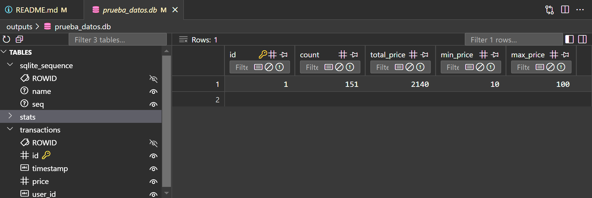
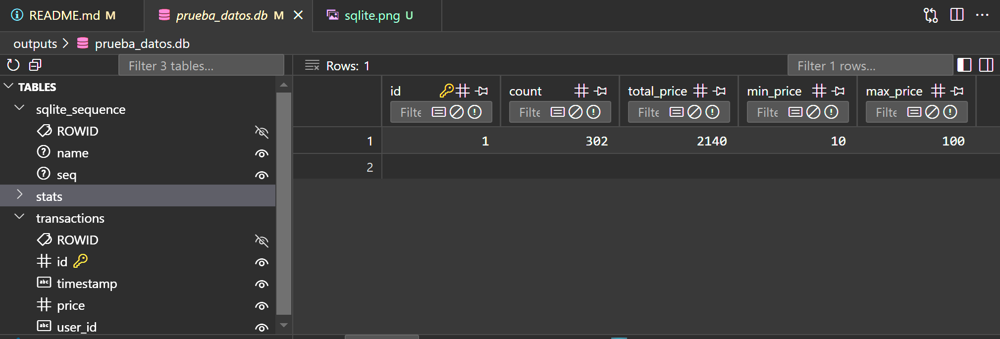

# Pipeline de Micro-Batches
Implementar un pipeline que carga archivos CSV por micro-batches en una base de datos SQLite, y calcula estadísticas acumuladas (`count`, `avg`, `min`, `max`) de forma incremental sin recalcular desde cero.

## Qué hace este pipeline?
- Procesa archivos `2012-1.csv` a `2012-5.csv`, **uno por uno**.
- Inserta los registros en una base de datos local SQLite (`outputs/prueba_datos.db`).
- Calcula estadísticas acumuladas (`count`, `avg`, `min`, `max`) sin borrar datos anteriores.
- Procesa al final un archivo `validation.csv` como si fuera un **batch de validación**.
- Imprime por consola las estadísticas acumuladas después de cada carga.

## Tecnologías utilizadas
- **Python 3**
- **SQLite3** (base de datos embebida)
- **Docker** (entorno aislado y reproducible)
- **Makefile** (automatización del flujo)
- **pandas** (procesamiento de archivos CSV)

## Requisitos previos
- Tener **Docker Desktop** encendido.
- Tener acceso al comando `make` (puede usarse desde Git Bash o WSL si estás en Windows).
- Asegurarse de tener los archivos CSV en `data/`.

## Pasos para ejecutar el proyecto
### 1. Encender Docker
Abre Docker Desktop y asegúrate de que está corriendo correctamente.

### 2. Ejecutar todo el entorno con Make
Desde la raíz del proyecto, ejecuta:
```bash
make run
```

### 3. Ejecutar el pipeline manualmente dentro del contenedor:
```bash
python pipeline/run.py
```

### 4. Limpieza de datos:
```bash
make clean
```
Esto eliminara el archivo outputs/prueba_datos.db.

### 5. Notas adicionales
- El procesamiento se hace en orden (2012-1.csv hasta 2012-5.csv, luego validation.csv).

- El código está modularizado: 
    * run.py: orquesta
    * database.py: maneja la DB
    * stats_tracker.py: procesamiento

## 6. Evidencia visual del resultado

A continuación se muestran capturas del resultado en la base de datos SQLite:

### Vista de las 3 tablas creadas


### Vista de la tabla `stats` con valores acumulados


### 7. (Opcional) Ver el contenido de la base SQLite
outputs/prueba_datos.db

### 8. Autor:
Henderson Palomino